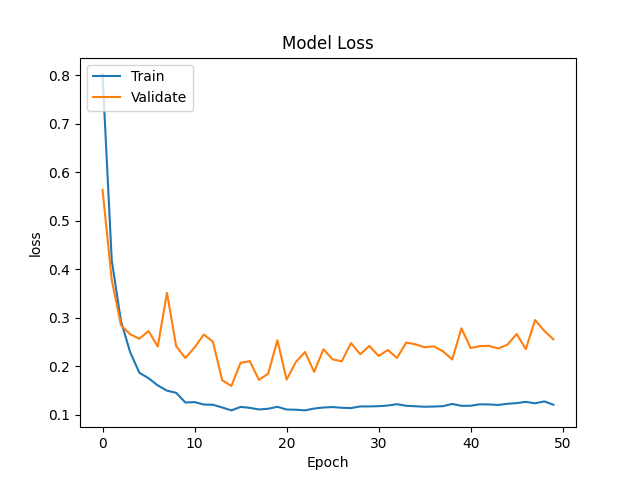
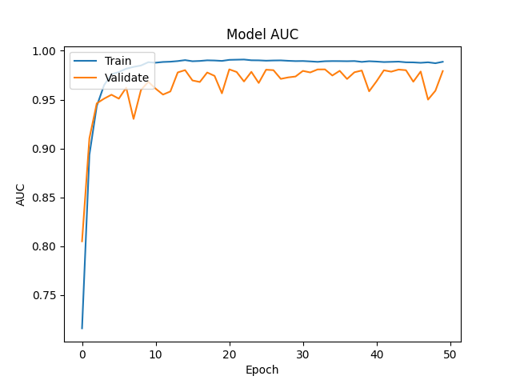
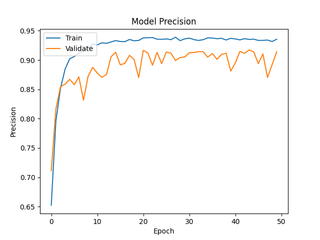
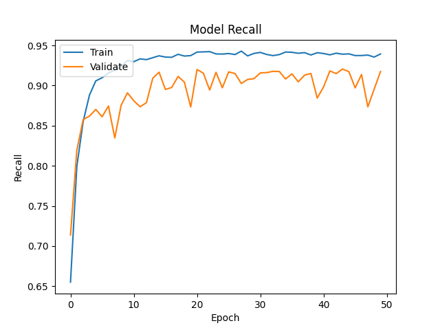
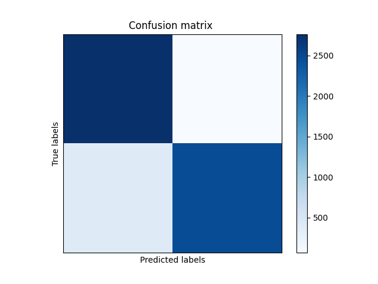

# Peter Moss COVID-19 AI Research Project

## COVID-19 AI Classification

### COVID-19 Tensorflow DenseNet Classifier

[](https://github.com/COVID-19-AI-Research-Project/AI-Classification)

&nbsp;

# Table Of Contents

- [Introduction](#introduction)
- [Installation](#installation)
- [Train](#train)
  - [Start Training](#start-training)
  - [Data Processing](#data-processing)
  - [Model Summary](#model-summary)
  - [Training Results](#training-results)
  - [Metrics Overview](#metrics-overview)
  - [Figures Of Merit](#figures-of-merit)
- [Real World Testing](#real-world-testing)
  - [Local Classifier](#local-classifier)
    - [Output](#local-classifier-output)
  - [HTTP Classifier](#http-classifier)
    - [Output](#http-classifier-output)
- [Citation](#citation)
- [Contributing](#contributing)
  - [Contributors](#contributors)
- [Versioning](#versioning)
- [License](#license)
- [Bugs/Issues](#bugs-issues)

&nbsp;

# Introduction

This project provides the source codes and tutorial for creating a Convolutional Neural Network for detecting COVID-19 in CT-Scans.

We will be using Tensorflow 2 to create a DenseNet implementation using [SARS-COV-2 Ct-Scan Dataset](https://www.kaggle.com/plameneduardo/sarscov2-ctscan-dataset "SARS-COV-2 Ct-Scan Dataset"), a large dataset of CT scans for SARS-CoV-2 (COVID-19) identification created by our collaborators, Plamenlancaster: [Professor Plamen Angelov](https://www.lancaster.ac.uk/lira/people/#d.en.397371) from [Lancaster University](https://www.lancaster.ac.uk/)/ Centre Director @ [Lira](https://www.lancaster.ac.uk/lira/), & his researcher, [Eduardo Soares PhD](https://www.lancaster.ac.uk/sci-tech/about-us/people/eduardo-almeida-soares).

&nbsp;

# Installation

Please follow the [Installation Guide](Documentation/Installation/Installation.md) to install COVID-19 Tensorflow DenseNet Classifier.

&nbsp;

# Train

Assuming you have completed the installation guide, you can now begin training.

## Start Training

Navigate to the project root and exectute the following command:

```
python3 COVID19DN.py Train
```

### Data Processing

First the data will be processed and augmented.

```
2020-06-10 06:13:10,647 - Data - INFO - Data shape: (22329, 64, 64, 3)
2020-06-10 06:13:10,647 - Data - INFO - Raw data: 22239
2020-06-10 06:13:10,647 - Data - INFO - Raw negative data: 0
2020-06-10 06:13:10,647 - Data - INFO - Raw positive data: 22239
2020-06-10 06:13:10,647 - Data - INFO - Augmented data: (22329, 64, 64, 3)
2020-06-10 06:13:10,647 - Data - INFO - Labels: (22329, 2)
2020-06-10 06:13:10,844 - Data - INFO - Training data: (16635, 64, 64, 3)
2020-06-10 06:13:10,844 - Data - INFO - Training labels: (16635, 2)
2020-06-10 06:13:10,845 - Data - INFO - Validation data: (5694, 64, 64, 3)
2020-06-10 06:13:10,845 - Data - INFO - Validation labels: (5694, 2)
```

### Model Summary

You will be shown the model summary before the training begins.

```
Model: "model"
_________________________________________________________________
Layer (type)                 Output Shape              Param #
=================================================================
input_1 (InputLayer)         [(None, 64, 64, 3)]       0
_________________________________________________________________
conv2d (Conv2D)              (None, 64, 64, 3)         84
_________________________________________________________________
densenet121 (Model)          multiple                  7037504
_________________________________________________________________
global_average_pooling2d (Gl (None, 1024)              0
_________________________________________________________________
batch_normalization (BatchNo (None, 1024)              4096
_________________________________________________________________
dropout (Dropout)            (None, 1024)              0
_________________________________________________________________
dense (Dense)                (None, 256)               262400
_________________________________________________________________
batch_normalization_1 (Batch (None, 256)               1024
_________________________________________________________________
dropout_1 (Dropout)          (None, 256)               0
_________________________________________________________________
root (Dense)                 (None, 2)                 514
=================================================================
Total params: 7,305,622
Trainable params: 7,219,414
Non-trainable params: 86,208
_________________________________________________________________
2020-06-10 06:13:16,731 - Model - INFO - Network initialization complete.
2020-06-10 06:13:16,731 - Model - INFO - Using Adam Optimizer.
Train on 16635 samples, validate on 5694 samples
```

### Training Results

When training finishes you will be shown the metrics and figures of merit. If you are using Tensorflow GPU these results will vary per train. For stable results each time you should use CPU for training.


_Fig 1. Accuracy_



_Fig 2. Loss_



_Fig 3. AUC_



_Fig 4. Precision_



_Fig 5. Recall_



_Fig 6. Confusion Matrix_

```
2020-06-10 06:51:21,373 - Model - INFO - Metrics: loss 0.2550957485494339
2020-06-10 06:51:21,373 - Model - INFO - Metrics: acc 0.9159642
2020-06-10 06:51:21,374 - Model - INFO - Metrics: precision 0.91412014
2020-06-10 06:51:21,374 - Model - INFO - Metrics: recall 0.91750395
2020-06-10 06:51:21,374 - Model - INFO - Metrics: auc 0.9793119

2020-06-10 06:51:22,053 - Model - INFO - Confusion Matrix: [[2762   68]
 [ 400 2464]]

2020-06-10 06:51:22,213 - Model - INFO - True Positives: 2464(43.273621355813134%)
2020-06-10 06:51:22,213 - Model - INFO - False Positives: 68(1.194239550403934%)
2020-06-10 06:51:22,213 - Model - INFO - True Negatives: 2762(48.507200561995084%)
2020-06-10 06:51:22,213 - Model - INFO - False Negatives: 400(7.024938531787847%)
2020-06-10 06:51:22,213 - Model - INFO - Specificity: 0.9759717314487633
2020-06-10 06:51:22,213 - Model - INFO - Misclassification: 468(8.219178082191782%)
```

### Metrics Overview

| Accuracy  | Recall     | Precision  | AUC/ROC   |
| --------- | ---------- | ---------- | --------- |
| 0.9159642 | 0.91750395 | 0.91412014 | 0.9793119 |

### Figures Of Merit

| Figures of merit     | Amount/Value       | Percentage          |
| -------------------- | ------------------ | ------------------- |
| True Positives       | 2464               | 43.273621355813134% |
| False Positives      | 68                 | 1.194239550403934%  |
| True Negatives       | 2762               | 48.507200561995084% |
| False Negatives      | 400                | 7.024938531787847%  |
| Misclassification    | 468                | 8.219178082191782%  |
| Sensitivity / Recall | 0.91750395         | 92%                 |
| Specificity          | 0.9759717314487633 | 98%                 |

&nbsp;

# Real World Testing

On paper, our model seems to be working very well. But the real test is to use the classifier in a real world scenario. Later on we will integrate the classifier with the [HIAS UI](https://github.com/LeukemiaAiResearch/HIAS "HIAS UI"), but first we will test the classifier locally, and via HTTP requests to the endpoint that exposes the model for remote classification.

The system uses the test files specified in the configuration, as show in the [Installation Guide](Documentation/Installation/Installation.md).

## Local Classifier

First we will test our classifier locally. Navigate to the project root and use the following command:

```
python3 COVID19DN.py Classify
```

### Local Classifier Output

```
2020-06-10 07:24:29,956 - Model - INFO - Loaded test image Model/Data/0/Non-Covid (1).png
2020-06-10 07:24:32,659 - Model - INFO - Predicted Label: 0
2020-06-10 07:24:32,659 - Model - INFO - COVID-19 correctly not detected (True Negative)
2020-06-10 07:24:32,664 - Model - INFO - Loaded test image Model/Data/0/Non-Covid (54).png
2020-06-10 07:24:32,704 - Model - INFO - Predicted Label: 0
2020-06-10 07:24:32,704 - Model - INFO - COVID-19 correctly not detected (True Negative)
2020-06-10 07:24:32,708 - Model - INFO - Loaded test image Model/Data/0/Non-Covid (104).png
2020-06-10 07:24:32,747 - Model - INFO - Predicted Label: 0
2020-06-10 07:24:32,748 - Model - INFO - COVID-19 correctly not detected (True Negative)
2020-06-10 07:24:32,750 - Model - INFO - Loaded test image Model/Data/0/Non-Covid (389).png
2020-06-10 07:24:32,788 - Model - INFO - Predicted Label: 0
2020-06-10 07:24:32,788 - Model - INFO - COVID-19 correctly not detected (True Negative)
2020-06-10 07:24:32,793 - Model - INFO - Loaded test image Model/Data/0/Non-Covid (582).png
2020-06-10 07:24:32,830 - Model - INFO - Predicted Label: 0
2020-06-10 07:24:32,830 - Model - INFO - COVID-19 correctly not detected (True Negative)
2020-06-10 07:24:32,834 - Model - INFO - Loaded test image Model/Data/1/Covid (10).png
2020-06-10 07:24:32,872 - Model - INFO - Predicted Label: 1
2020-06-10 07:24:32,872 - Model - INFO - COVID-19 correctly detected (True Positive)
2020-06-10 07:24:32,874 - Model - INFO - Loaded test image Model/Data/1/Covid (76).png
2020-06-10 07:24:32,912 - Model - INFO - Predicted Label: 1
2020-06-10 07:24:32,912 - Model - INFO - COVID-19 correctly detected (True Positive)
2020-06-10 07:24:32,915 - Model - INFO - Loaded test image Model/Data/1/Covid (156).png
2020-06-10 07:24:32,953 - Model - INFO - Predicted Label: 1
2020-06-10 07:24:32,953 - Model - INFO - COVID-19 correctly detected (True Positive)
2020-06-10 07:24:32,957 - Model - INFO - Loaded test image Model/Data/1/Covid (356).png
2020-06-10 07:24:32,995 - Model - INFO - Predicted Label: 1
2020-06-10 07:24:32,995 - Model - INFO - COVID-19 correctly detected (True Positive)
2020-06-10 07:24:32,997 - Model - INFO - Loaded test image Model/Data/1/Covid (675).png
2020-06-10 07:24:33,037 - Model - INFO - Predicted Label: 0
2020-06-10 07:24:33,037 - Model - INFO - COVID-19 incorrectly not detected (False Negative)
2020-06-10 07:24:33,037 - Model - INFO - Images Classified: 10
2020-06-10 07:24:33,037 - Model - INFO - True Positives: 4
2020-06-10 07:24:33,037 - Model - INFO - False Positives: 0
2020-06-10 07:24:33,037 - Model - INFO - True Negatives: 5
2020-06-10 07:24:33,037 - Model - INFO - False Negatives: 1
```

## HTTP Classifier

Next we will test our classifier server. Navigate to the project root and use the following command:

```
python3 COVID19DN.py Server
```

Then in a new terminal, navigate to the project root and issue the following command:

```
python3 COVID19DN.py Client
```

### HTTP Classifier Output

#### Server

```
192.168.1.### - - [11/Jun/2020 01:36:54] "POST /Inference HTTP/1.1" 200 -
192.168.1.### - - [11/Jun/2020 01:37:01] "POST /Inference HTTP/1.1" 200 -
192.168.1.### - - [11/Jun/2020 01:37:08] "POST /Inference HTTP/1.1" 200 -
192.168.1.### - - [11/Jun/2020 01:37:16] "POST /Inference HTTP/1.1" 200 -
192.168.1.### - - [11/Jun/2020 01:37:23] "POST /Inference HTTP/1.1" 200 -
192.168.1.### - - [11/Jun/2020 01:37:30] "POST /Inference HTTP/1.1" 200 -
192.168.1.### - - [11/Jun/2020 01:37:37] "POST /Inference HTTP/1.1" 200 -
192.168.1.### - - [11/Jun/2020 01:37:44] "POST /Inference HTTP/1.1" 200 -
192.168.1.### - - [11/Jun/2020 01:37:51] "POST /Inference HTTP/1.1" 200 -
192.168.1.### - - [11/Jun/2020 01:37:58] "POST /Inference HTTP/1.1" 200 -
```

#### Client

```
2020-06-11 01:36:51,420 - Model - INFO - Sending request for: Model/Data/0/Non-Covid (1).png
2020-06-11 01:36:54,299 - Model - INFO - COVID-19 correctly not detected (True Negative)

2020-06-11 01:37:01,307 - Model - INFO - Sending request for: Model/Data/0/Non-Covid (54).png
2020-06-11 01:37:01,897 - Model - INFO - COVID-19 correctly not detected (True Negative)

2020-06-11 01:37:08,905 - Model - INFO - Sending request for: Model/Data/0/Non-Covid (104).png
2020-06-11 01:37:08,960 - Model - INFO - COVID-19 correctly not detected (True Negative)

2020-06-11 01:37:15,966 - Model - INFO - Sending request for: Model/Data/0/Non-Covid (389).png
2020-06-11 01:37:16,018 - Model - INFO - COVID-19 correctly not detected (True Negative)

2020-06-11 01:37:23,026 - Model - INFO - Sending request for: Model/Data/0/Non-Covid (582).png
2020-06-11 01:37:23,082 - Model - INFO - COVID-19 correctly not detected (True Negative)

2020-06-11 01:37:30,086 - Model - INFO - Sending request for: Model/Data/1/Covid (10).png
2020-06-11 01:37:30,176 - Model - INFO - COVID-19 correctly detected (True Positive)

2020-06-11 01:37:37,182 - Model - INFO - Sending request for: Model/Data/1/Covid (76).png
2020-06-11 01:37:37,237 - Model - INFO - COVID-19 correctly detected (True Positive)

2020-06-11 01:37:44,245 - Model - INFO - Sending request for: Model/Data/1/Covid (156).png
2020-06-11 01:37:44,302 - Model - INFO - COVID-19 correctly detected (True Positive)

2020-06-11 01:37:51,310 - Model - INFO - Sending request for: Model/Data/1/Covid (356).png
2020-06-11 01:37:51,388 - Model - INFO - COVID-19 correctly detected (True Positive)

2020-06-11 01:37:58,396 - Model - INFO - Sending request for: Model/Data/1/Covid (675).png
2020-06-11 01:37:58,447 - Model - INFO - COVID-19 incorrectly not detected (False Negative)

2020-06-11 01:38:05,454 - Model - INFO - Images Classifier: 10
2020-06-11 01:38:05,455 - Model - INFO - True Positives: 4
2020-06-11 01:38:05,455 - Model - INFO - False Positives: 0
2020-06-11 01:38:05,455 - Model - INFO - True Negatives: 5
2020-06-11 01:38:05,455 - Model - INFO - False Negatives: 1
```

&nbsp;

# Citation

```
Angelov, Plamen, and Eduardo Almeida Soares. "EXPLAINABLE-BY-DESIGN APPROACH FOR COVID-19 CLASSIFICATION VIA CT-SCAN." medRxiv (2020).
Soares, Eduardo, Angelov, Plamen, Biaso, Sarah, Higa Froes, Michele, and Kanda Abe, Daniel. "SARS-CoV-2 CT-scan dataset: A large dataset of real patients CT scans for SARS-CoV-2 identification." medRxiv (2020). doi: https://doi.org/10.1101/2020.04.24.20078584.

Link:
https://www.medrxiv.org/content/10.1101/2020.04.24.20078584v2
```

&nbsp;

# Contributing

The Peter Moss Acute Myeloid & Lymphoblastic Leukemia AI Research project encourages and welcomes code contributions, bug fixes and enhancements from the Github.

Please read the [CONTRIBUTING](../../CONTRIBUTING.md "CONTRIBUTING") document for a full guide to forking our repositories and submitting your pull requests. You will also find information about our code of conduct on this page.

## Contributors

- [Adam Milton-Barker](https://www.leukemiaresearchassociation.ai/team/adam-milton-barker "Adam Milton-Barker") - [Peter Moss Leukemia AI Research](https://www.leukemiaresearchassociation.ai "Peter Moss Leukemia AI Research") Founder & Intel Software Innovator, Sabadell, Spain

&nbsp;

# Versioning

We use SemVer for versioning. For the versions available, see [Releases](../../releases "Releases").

&nbsp;

# License

This project is licensed under the **MIT License** - see the [LICENSE](../../LICENSE "LICENSE") file for details.

&nbsp;

# Bugs/Issues

We use the [repo issues](../../issues "repo issues") to track bugs and general requests related to using this project. See [CONTRIBUTING](../../CONTRIBUTING.md "CONTRIBUTING") for more info on how to submit bugs, feature requests and proposals.
